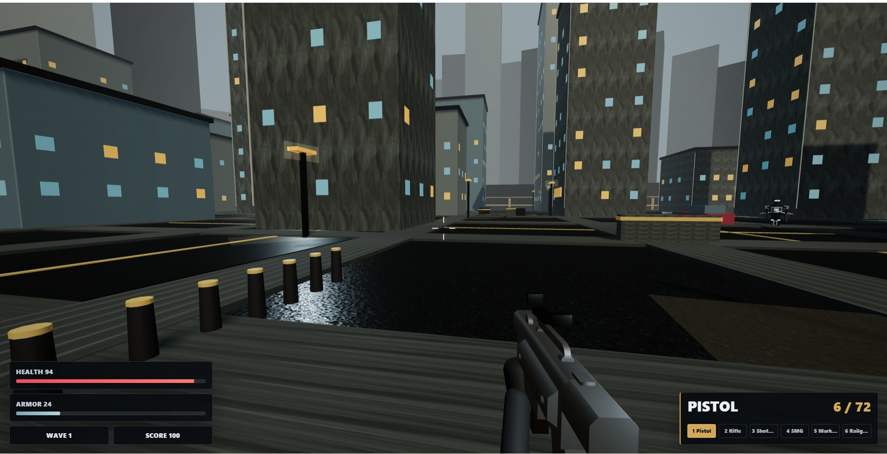

<div align="center">

# 🌃 Cybercity FPS

**A high-octane browser-based first-person shooter prototype built with Three.js and Vite.**

[](https://threejs.org/)
[](https://vitejs.dev/)
[](https://developer.mozilla.org/en-US/docs/Web/JavaScript)



</div>

## 📖 Overview

**Cybercity: Neon Sector FPS** drops players into a dense night-time city grid. Featuring switchable weapons, scoped aiming, reactive enemies, destructible map objects, and a tactical squad director for dynamic enemy behavior, the game pushes the boundaries of web-based FPS experiences.

---

## ✨ Features

- **Advanced Player Mechanics:** First-person movement with collision handling, sprinting, crouching, jumping, and smooth camera/weapon motion.
- **Detailed Environments:** Dense city map featuring street lighting, roads, sidewalks, props, destructible barrels, cover objects, and PBR materials from ambientCG.
- **Arsenal of Weapons:** 6 distinct weapon classes—Pistol, Rifle, Shotgun, SMG, Marksman, and Railgun.
- **Gunplay Polish:** Aim-down-sights (ADS), scoped overlays, recoil tuning, muzzle flashes, shell ejections, impact effects, and satisfying hit markers.
- **Tactical Enemy AI:** Enemies share squad memory, flank, suppress, select cover, and utilize pathfinding grid meshes. Complete with localized hitboxes (headshots/limb damage).
- **Interactive HUD:** Features health, armor, score, weapon slots, ammo tracking, reload sequences, damage vignettes, and crosshair overlays.

---

## 🎮 Controls

| Keys / Input | Action |
| :---: | :--- |
| <kbd>W</kbd> <kbd>A</kbd> <kbd>S</kbd> <kbd>D</kbd> | Move |
| <kbd>Mouse</kbd> | Look / Aim |
| <kbd>Left Click</kbd> | Fire Weapon |
| <kbd>Right Click</kbd> | Aim Down Sights / Scope |
| <kbd>1</kbd> - <kbd>6</kbd> | Switch Weapons |
| <kbd>R</kbd> | Reload |
| <kbd>Shift</kbd> | Sprint |
| <kbd>Ctrl</kbd> | Crouch |
| <kbd>Space</kbd> | Jump |
| <kbd>Esc</kbd> | Pause / Resume |

---

## 🚀 Getting Started

### Prerequisites

Make sure you have [Node.js](https://nodejs.org/) installed.

### Installation & Setup

1. **Install dependencies:**
   ```bash
   npm install
   ```

2. **Run the local development server:**
   ```bash
   npm run dev
   ```
   *The game should now be accessible at `http://127.0.0.1:5173/`.*

### Building for Production

Compile the project and optimize assets for deployment (e.g., to Vercel):

```bash
npm run build
```

Preview the minified production build locally:

```bash
npm run preview
```

---

## 📂 Project Structure

```text
cybercityFPS/
├── index.html        # Main HTML UI and canvas entry point
├── src/              # Game source code
│   ├── main.js       # Game logic, rendering, and AI
│   └── style.css     # HUD and overlay styling
├── public/           # Static assets (Not bundled via Vite)
│   └── assets/       # Models, Textures, and Audio files
├── ASSETS.md         # Detailed breakdown of asset credits
├── package.json      # Dependencies and scripts
└── README.md         # Project documentation
```

---

## 🎨 Assets & Credits

This project utilizes incredible free external assets from talented creators:
* **[Kenney](https://kenney.nl/)**: Blaster Kit, Animated Characters, and City Kits.
* **OpenGameArt**: Sound effects.
* **ambientCG**: High-quality PBR material textures.

For the full detailed source and license breakdown, please review the [**ASSETS.md**](ASSETS.md) file.
